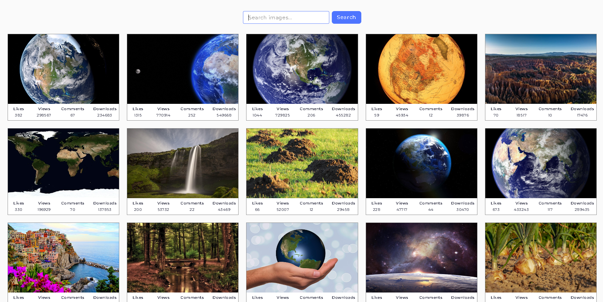

# Image Search App

A responsive image search application built with JavaScript and the Pixabay API.

Users can search for images, browse paginated results, open images in a lightbox and load additional results without refreshing the page.

## Live Demo

[View the live application](https://erenaysener.github.io/image-search-app/)

## Preview



## Features

- Search images using the Pixabay API
- Display 40 images per request
- Load additional results with the "Load more" button
- Image previews with SimpleLightbox
- Loading indicator during API requests
- User feedback and error notifications with iziToast
- Automatic detection of the end of search results
- Smooth scrolling after loading more images
- Responsive image gallery
- Environment variable support for the Pixabay API key

## Technologies

- HTML5
- CSS3
- JavaScript
- Axios
- Pixabay API
- SimpleLightbox
- iziToast
- Vite
- GitHub Actions
- GitHub Pages

## Getting Started

Clone the repository:

```bash
git clone https://github.com/ErenaySener/image-search-app.git
```

Navigate to the project directory:

```bash
cd image-search-app
```

Install dependencies:

```bash
npm install
```

Create a `.env` file in the project root:

```env
VITE_PIXABAY_API_KEY=your_pixabay_api_key
```

Start the development server:

```bash
npm run dev
```

## Build

Create a production build:

```bash
npm run build
```

Preview the production build locally:

```bash
npm run preview
```

## Project Structure

```text
src/
├── css/
│   └── styles.css
├── js/
│   ├── pixabay-api.js
│   └── render-functions.js
├── index.html
└── main.js
```

## API

The application uses the Pixabay API to retrieve image results based on user search queries.

The API key is stored in an environment variable and is not committed directly to the source code.

## Deployment

The project is automatically built and deployed to GitHub Pages using GitHub Actions.

## What This Project Demonstrates

- Working with a third-party REST API
- Asynchronous JavaScript
- Axios requests
- Pagination
- DOM manipulation
- Loading and error states
- Environment variables
- Responsive frontend development
- Automated deployment with GitHub Actions

## Author

**Erenay Sener**

GitHub: [ErenaySener](https://github.com/ErenaySener)
